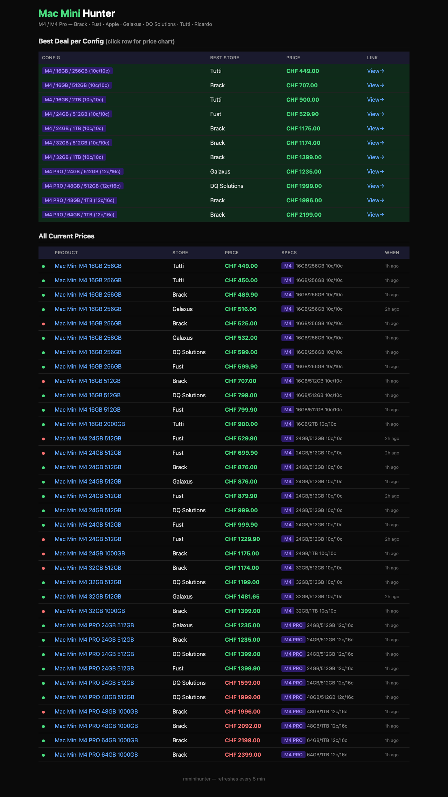
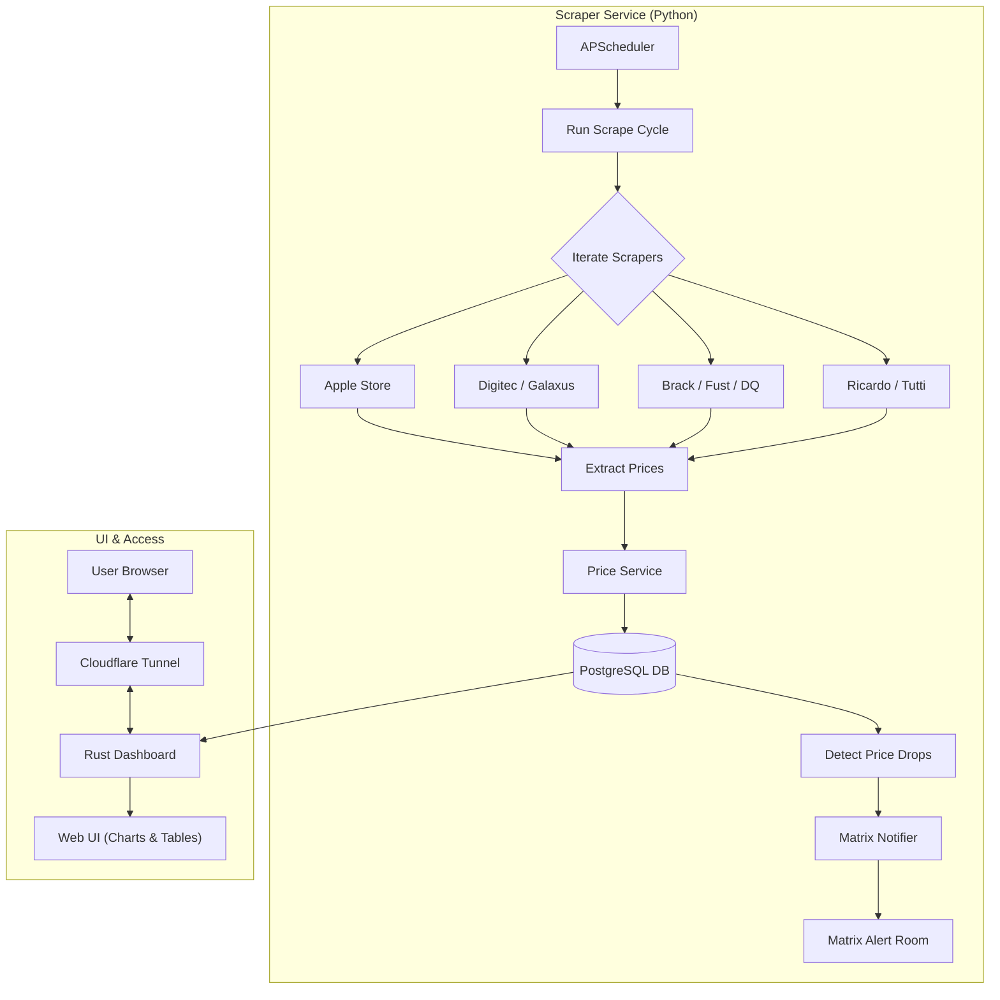

# Mac Mini Hunter 

A specialized price tracking and monitoring system for Apple Mac Mini M4 / M4 Pro models across major Swiss retailers.

## Features
- **Automated Scraping**: Regularly monitors prices from multiple Swiss stores.
- **Intelligent Matching**: Uses Apple SKUs for precise configuration matching (M4 vs M4 Pro, RAM, SSD).
- **Price History**: Tracks price fluctuations over time.
- **Matrix Notifications**: Sends instant alerts for price drops and daily summaries to a Matrix (Element) room.
- **Performance Dashboard**: Lightweight Rust-based dashboard with visual price history charts.
- **Stealth Mode**: Implements randomized delays and headers to prevent bot detection.

## Dashboard Preview


## Supported Stores
- **Official**: Apple Store (Switzerland)
- **Retailers**: Digitec, Galaxus, Brack.ch, Fust, DQ Solutions
- **Classifieds/Auctions**: Ricardo, Tutti.ch
- **Price Aggregators**: Toppreise.ch

---

## Technical Architecture

### Logic Flow



### Tech Stack
- **Backend (Scraper)**: Python 3.11+
  - *SQLAlchemy*: ORM for database interactions.
  - *APScheduler*: Task scheduling for scraping cycles.
  - *Requests / BeautifulSoup*: Web scraping and HTML parsing.
- **Database**: PostgreSQL 16
  - *Alembic*: Database migrations and versioning.
- **Frontend (Dashboard)**: Rust (Actix-web)
  - *SQLx*: Async SQL toolkit.
  - *Chart.js*: Client-side price history visualization.
- **Deployment**: Docker & Docker Compose
- **Network**: Cloudflare Tunnel for secure remote access without exposing ports.

---

## Database Schema

The system uses a relational schema optimized for tracking products across multiple stores.

### Tables

1.  **`products`**
    - `id`: Primary Key
    - `name`: Product display name.
    - `chip`: Processor type (e.g., "M4", "M4 Pro").
    - `ram`: Memory in GB.
    - `ssd`: Storage in GB.
    - `cpu_cores` / `gpu_cores`: Core counts for performance tiers.
    - `condition`: enum (`new`, `used`, `refurbished`).

2.  **`stores`**
    - `id`: Primary Key
    - `name`: Store name (e.g., "Digitec").
    - `base_url`: Root URL of the retailer.

3.  **`product_links`**
    - `id`: Primary Key
    - `product_id`: FK to `products`.
    - `store_id`: FK to `stores`.
    - `url`: Exact product page URL.
    - `external_id`: Retailer-specific identifier (e.g., SKU or Product ID).

4.  **`price_history`**
    - `id`: Primary Key
    - `link_id`: FK to `product_links`.
    - `price_chf`: Current price in Swiss Francs.
    - `availability`: Boolean status.
    - `scraped_at`: Timestamp of the data collection.

---

## Installation & Setup

### Prerequisites
- Docker and Docker Compose installed.
- A Matrix account and Room ID (for notifications).
- A Cloudflare Zero Trust account (for the dashboard tunnel).

### 1. Configuration
Copy the environment template and fill in your credentials:
```bash
cp .env.example .env
```

Key variables to set:
- `POSTGRES_PASSWORD`: Strong password for the database.
- `MATRIX_ACCESS_TOKEN` & `MATRIX_ROOM_ID`: For price drop alerts.
- `DASH_USER` & `DASH_PASS`: Credentials for the web dashboard.
- `CLOUDFLARE_TUNNEL_TOKEN`: Your Cloudflare Zero Trust tunnel token.

### 2. Deployment
Start the entire stack using Docker Compose:
```bash
docker-compose up -d --build
```

This will launch:
- `db`: PostgreSQL database.
- `scraper`: Python service that runs periodically.
- `dashboard`: Rust web server (internal port 8080).
- `cloudflared`: Secure tunnel connecting the dashboard to your domain.

### 3. Database Initialization
Tables are automatically created on first run via SQLAlchemy, but it is recommended to use Alembic for production environments:
```bash
docker-compose exec scraper alembic upgrade head
```

---

## Usage

### Monitoring
The scraper runs every 6 hours (configurable via `SCRAPE_INTERVAL_HOURS`). It traverses stores, identifies Mac Mini M4 models, and updates the database.

### Alerts
When a price drop of >5% is detected within a 7-day window, a message is sent to your Matrix room with a direct link to the deal.

### Dashboard
Access your dashboard via your Cloudflare-configured domain.
- **Best Deals**: Shows the cheapest price for every unique Mac Mini configuration.
- **Price Charts**: Click on any deal to see the historical price trend for that specific model.
- **Live Feed**: Shows the latest 200 price updates across all stores.

---

## Development

### Running Tests
```bash
pytest
```

### Adding a New Scraper
1. Create a new class in `src/scrapers/` inheriting from `BaseScraper`.
2. Implement the `run()` method.
3. Register the scraper in `src/main.py`.

---

## Security
- The dashboard is protected by **Basic Authentication**.
- No database ports are exposed to the public internet.
- All external traffic is routed through an encrypted **Cloudflare Tunnel**.
